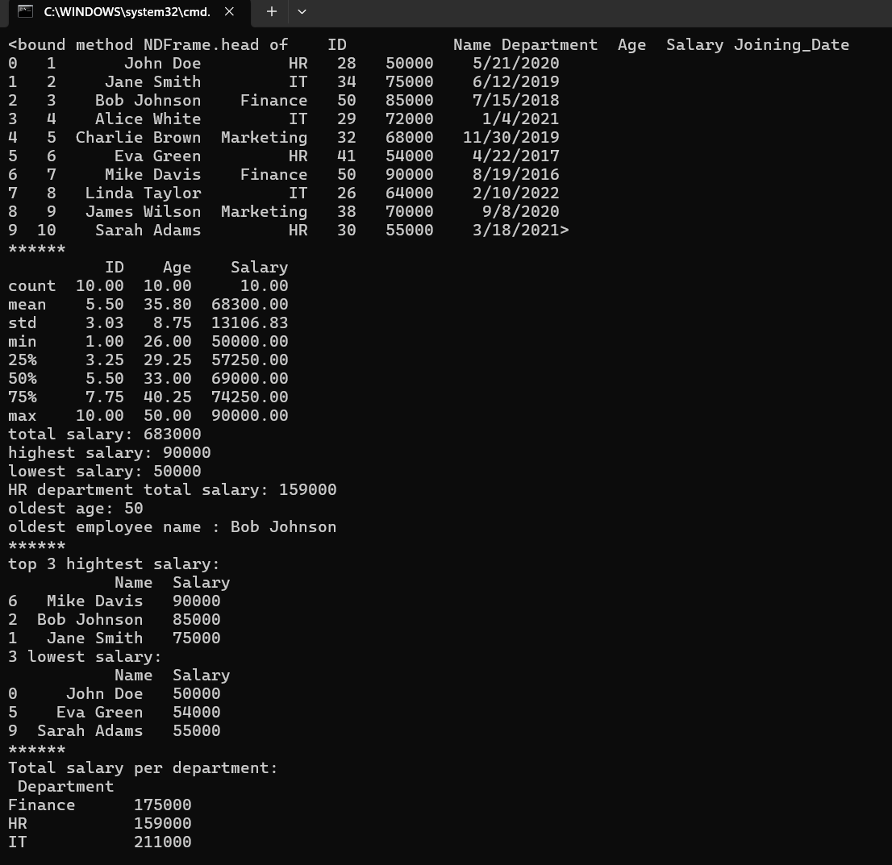
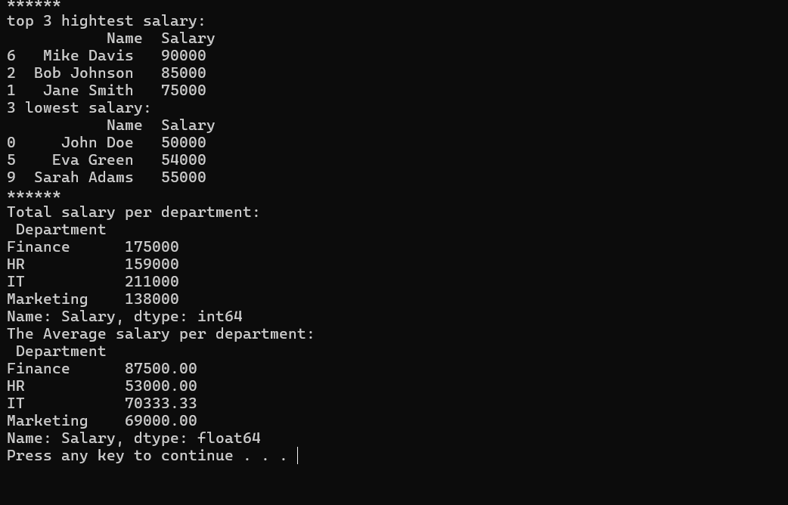

# Employee-Data-Analysis-with-Pandas
This project analyzes employee data using Python (Pandas).   It calculates salary statistics, finds the highest and lowest salaries, identifies the oldest employee, and provides department-wise insights.   The analysis also uses groupby to summarize salaries by department (total and average).
## Features
- Load employee data from CSV file.  
- Display dataset columns.  
- Calculate total salary of all employees.  
- Find highest and lowest salary.  
- Calculate total salary of HR department.  
- Find the oldest employee age.  
- Display the name of the oldest employee.  
- Show top 3 employees with highest salaries.  
- Show bottom 3 employees with lowest salaries.  
- Group employees by department and calculate:
  - Total salary per department.
  - Average salary per department.

